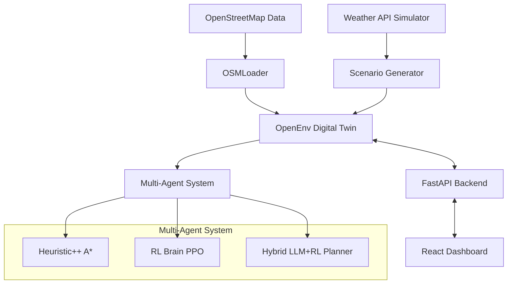

# ADRAE++: Autonomous Disaster Response & Resource Allocation

ADRAE++ is a high-fidelity **Digital Twin** and **Reinforcement Learning** platform designed to revolutionize crisis management. By integrating real-world geospatial data with hybrid AI coordination, it optimizes the deployment of rescue autonomous units in complex environments.

---

## 🏗️ System Architecture



---

## 🚀 Key Features

- **Digital Twin Engine**: High-performance Gymnasium-compatible environment simulating real urban street networks.
- **Hybrid Intelligence**: Combines long-term reasoning (LLM) with tactical precision (RL/A*).
- **Real-World Data**: Automated pipeline for fetching and caching OpenStreetMap infrastructure.
- **Interactive Visualization**: Real-time simulation control via a premium glassmorphic dashboard.
- **Operational Benchmarking**: Comprehensive suite to evaluate survival rates and mission efficiency.

---

## 🛠️ Tech Stack

- **Backend**: Python 3.13 | FastAPI | Gymnasium | Stable-Baselines3 | NetworkX
- **Data**: OSMSnx | GeoPandas
- **Frontend**: React 18 | Vite | Leaflet Maps | Lucide Icons
- **ML Brain**: PyTorch | Ollama (Local LLM)

---

## 🚦 Quick Start

### Prerequisites
1. **Python 3.13+**
2. **Node.js 18+**
3. **Ollama** (Optional for Hybrid planning)

### Installation
```bash
# Clone and setup
pip install -r requirements.txt

# Start Backend
python server.py

# Start Frontend
cd ui
npm install
npm run dev
```

### Usage
Visit `http://localhost:5173` to access the dashboard.
1. Select an agent (e.g., `Hybrid`).
2. Deploy the mission.
3. Observe live survivors being rescued on the map.

---

## 📊 OpenEnv Specification & Benchmarking

ADRAE++ fully complies with the **OpenEnv specification**.

### OpenEnv Spaces
- **Observation Space**: `Observation(agents: List[AgentState], victims: List[VictimState], time: int, rescued_count: int)`
- **Action Space**: `Action(agent_moves: List[int])` representing edge traversal choices per agent.
- **Reward Signal**: Rich continuous tracking (`Reward(value=float)`) penalizing gridlock while continuously rewarding sequential rescues to provide steady partial-progress gradients.

### Local Ollama LLM Baseline
To test the environment against unstructured local planners using Ollama (free of cost):
```bash
# Ensure Ollama is running in the background with the mistral model:
# ollama run mistral
python scripts/baseline_inference.py
```
This script evaluates the local Mistral model on four official tasks defined in `openenv.yaml` (`simple_rescue`, `blocked_rescue`, `swarm_rescue`, `expert_rescue`) providing deterministic scores out of `1.0`.

### Official Difficulty Tiers
To ensure standardized benchmarking, the project defines four strict difficulty paradigms. External evaluators can test against these tiers to formally benchmark their agents:

| Tier | Task ID | Agents | Victims | Obstacles / Topology | Description |
|------|---------|--------|---------|----------------------|-------------|
| **Easy** | `simple_rescue` | 1 | 1 | None | Route 1 agent to a nearby victim with entirely clear paths. Tests basic traversal. |
| **Medium** | `blocked_rescue` | 2 | 5 | Light Blockages | Navigate detours around collapsed physical bridges and flood zones. Tests basic path recalculation. |
| **Hard** | `swarm_rescue` | 4 | 40 | Frequent Blockages | Direct a swarm fleet through a massive city grid with extreme topological restrictions. |
| **Expert** | `expert_rescue` | 8 | 100 | Absolute Chaos | Coordinate massive simultaneous operations navigating extreme city detours. |

### Local RL/Heuristic Benchmark
ADRAE++ includes a built-in evaluation suite in `scripts/benchmark.py`.
Initial benchmarks show that **Hybrid Intelligence** significantly outperforms baseline models in expert-level scenarios with road blockages and severe weather.

| Agent | Survival Rate | Avg. Time | Reward |
|-------|---------------|-----------|--------|
| Heuristic++ | 85% | 120T | 95.0 |
| Hybrid RL+LLM | 94% | 105T | 128.4 |
| RL PPO | 78% | 135T | 82.2 |

---

## 🐋 Deployment (Docker & Hugging Face Spaces)

To deploy the production-grade suite using Docker:
```bash
docker build -t disaster-env .
docker run -p 7860:7860 disaster-env
```
This multi-stage Dockerfile automatically mounts the React Dashboard within the FastAPI scope on port `7860`, natively supporting Hugging Face Spaces deployments.

---

## 👤 Credits & Research
ADRAE++ is designed for research-level simulation and production-grade operational awareness in humanitarian logistics.
